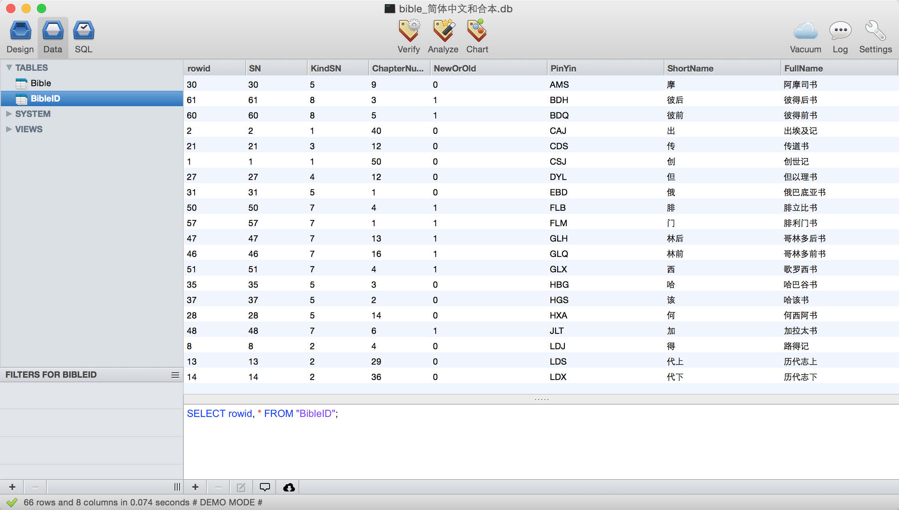

# 圣经数据库

此项目只包含圣经数据库文件。

我们在开发基督教行业软件的时候，发现网上的圣经数据库和常用的纸质和合本圣经的经文出入很大。经过搜索，我们找到了简体中文和合本（神版）圣经数据库，放到github上，供弟兄姊妹使用，希望弟兄姊妹能开发更多、更好的基督教行业软件。

以马内利。：）

若您有建议或问题，请在[这里提交](https://github.com/ElijahLabs/bible/issues)，或者发送邮件到[support@elijah.com.cn](mailto:support@elijah.com.cn)

## 圣经版本

简体中文和合本

## 数据库结构

## 数据库版本

- SQLite数据库 bible_简体中文和合本.db 下载[请戳这里](https://github.com/ElijahLabs/bible/raw/master/bible_%E7%AE%80%E4%BD%93%E4%B8%AD%E6%96%87%E5%92%8C%E5%90%88%E6%9C%AC.db)

- Access数据库 bible_简体中文和合本.mdb 下载[请戳这里](https://github.com/ElijahLabs/bible/raw/master/bible_%E7%AE%80%E4%BD%93%E4%B8%AD%E6%96%87%E5%92%8C%E5%90%88%E6%9C%AC.mdb)

- 全部下载[请戳这里](https://github.com/ElijahLabs/bible/archive/master.zip)

## 安装/配置

您只需要将数据库包含在您的程序里即可，不需要额外的安装和配置。